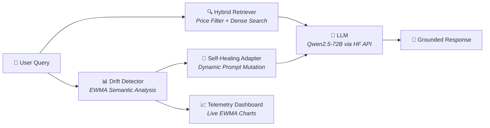

<div align="center">

# 🧠 RetailMind

### Self-Healing LLM for Store Intelligence

[](https://github.com/hodfa840/-RetailMind-Self-Healing-LLM-for-Store-Intelligence/actions)
[](https://python.org)
[](https://gradio.app)
[](https://huggingface.co/spaces/Hodfa71/RetailMind)

**An autonomous e-commerce AI that detects semantic drift in user intent and self-heals its own prompt in real time — no human in the loop.**

[**▶ Try the live demo**](https://huggingface.co/spaces/Hodfa71/RetailMind)

</div>

---


---

## What This Demonstrates

| Skill | Implementation |
|-------|----------------|
| **MLOps / Observability** | Real-time EWMA drift detection with live telemetry chart |
| **RAG / Retrieval** | Hybrid: metadata pre-filter (price, category) + dense semantic re-ranking |
| **Prompt Engineering** | Anti-hallucination grounding; dynamic system prompt injection on drift |
| **Self-Healing Systems** | Autonomous prompt rewriting when intent distribution shifts — zero human intervention |
| **LLM Integration** | HF Inference API (Qwen2.5-72B) for fast, grounded product recommendations |
| **Software Engineering** | Type hints, logging, pytest suite, CI/CD, modular architecture |

---

## Architecture



```
RetailMind/
├── app.py                    # Gradio UI — 3-panel dashboard
├── modules/
│   ├── shared.py             # Shared SentenceTransformer singleton
│   ├── data_simulation.py    # Curated product catalog with rich metadata
│   ├── retrieval.py          # Hybrid retriever (price-filter → semantic re-rank)
│   ├── drift.py              # EWMA-based semantic drift detector
│   ├── adaptation.py         # Self-healing prompt adapter
│   └── llm.py                # HF Inference API client
├── tests/                    # pytest suite
├── .github/workflows/ci.yml  # CI pipeline (Python 3.10–3.12)
└── requirements.txt
```

---

## How the Self-Healing Loop Works

The system monitors **semantic similarity** between incoming queries and concept anchors using an **Exponentially Weighted Moving Average (EWMA)**. When a concept's EWMA score crosses a threshold, the system rewrites its own instructions — instantly and autonomously.

| Concept | Example Triggers | What Changes |
|---------|-----------------|--------------|
| 💰 Price Sensitive | *"cheapest", "under $30", "budget"* | Prioritise lowest-price items, highlight savings |
| ☀️ Summer Shift | *"beach", "UV", "hot weather"* | Surface breathable/outdoor products |
| 🌿 Eco Trend | *"sustainable", "recycled", "organic"* | Lead with eco-credentials and certifications |

**Key insight:** Matching is semantic, not keyword-based. *"I care about the planet"* triggers the eco adaptation even though it contains no eco keywords — because it's semantically close to the concept anchor embedding.

---

## Hybrid Retrieval

Pure semantic search fails on structured queries like *"bags under $25"* — a $200 bag and a $20 bag may be equally relevant semantically. RetailMind solves this with a two-stage pipeline:

1. **NLU extraction** — regex parses price ceilings (`"under $50"`, `"budget of $30"`, `"cheapest"`)
2. **Category detection** — maps query terms to catalog categories
3. **Pre-filter** — removes violating products before any embedding work
4. **Semantic re-rank** — cosine similarity on `all-MiniLM-L6-v2` embeddings ranks survivors

```python
# "eco-friendly bag under $30"
# → price_cap=30, category="eco-friendly"
# → 68 products → 6 candidates → top 4 by semantic similarity
```

---

## Demo Walkthrough

Run through the four scenario phases in order:

1. **Phase 1 — Normal** &nbsp; General product questions. System responds in balanced mode.
2. **Phase 2 — Black Friday** &nbsp; Budget queries. Watch the gold drift line spike above the threshold. Price-prioritisation rules auto-inject.
3. **Phase 3 — Summer Shift** &nbsp; Summer queries. Cyan line rises; system pivots to warm-weather products without being told.
4. **Phase 4 — Eco Trend** &nbsp; Sustainability queries. Green line triggers; system starts citing certifications and materials.

The telemetry panel shows exactly what's happening: which drift was detected, what prompt rules were injected, and why.

---

## Quick Start

```bash
git clone https://github.com/hodfa840/-RetailMind-Self-Healing-LLM-for-Store-Intelligence.git
cd -RetailMind-Self-Healing-LLM-for-Store-Intelligence
pip install -r requirements.txt
HF_TOKEN=your_token python app.py
```

```bash
pytest tests/ -v
```

---

## Tech Stack

| Component | Technology |
|-----------|-----------|
| UI | Gradio 5.x |
| LLM | Qwen2.5-72B-Instruct via HF Inference API |
| Embeddings | SentenceTransformers · all-MiniLM-L6-v2 |
| Retrieval | Hybrid (NumPy cosine + metadata pre-filter) |
| Drift Detection | EWMA over sentence embeddings |
| Charting | Plotly |
| Testing | pytest |
| CI/CD | GitHub Actions |
| Language | Python 3.10+ |

---

## Key Design Decisions

| Decision | Rationale |
|----------|-----------|
| **EWMA over raw scores** | Single-query similarity is noisy. EWMA smooths the signal so the system doesn't flip modes on every query. α=0.35 balances reactivity with stability. |
| **Hybrid retrieval over pure semantic** | Semantic search alone can't enforce price constraints. Pre-filtering handles hard constraints before the expensive embedding step. |
| **Prompt injection over fine-tuning** | Dynamic prompt injection achieves the same behavioural shift as fine-tuning with zero training cost and instant reversibility. |
| **Shared embedding singleton** | Both the retriever and drift detector share one `SentenceTransformer` instance, and the query is encoded once per request — eliminating redundant computation. |

---

<div align="center">
<sub>Built by <a href="https://github.com/hodfa840">hodfa840</a> · Linköping University</sub>
</div>
