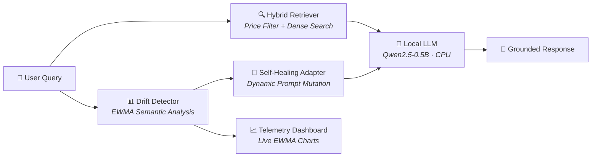

<div align="center">

# 🧠 RetailMind

### Self-Healing LLM for Store Intelligence

[](https://github.com/hodfa840/-RetailMind-Self-Healing-LLM-for-Store-Intelligence/actions)
[](https://python.org)
[](https://gradio.app)
[](https://huggingface.co/spaces/Hodfa71/RetailMind)
[](https://hodfa71-retailmind.hf.space/)

**An autonomous e-commerce AI that detects semantic drift in user intent and self-heals its own behavior in real time — no human in the loop.**

[Hugging Face Space](https://huggingface.co/spaces/Hodfa71/RetailMind) · [Direct App URL](https://hodfa71-retailmind.hf.space/) · [Architecture](#-architecture) · [How It Works](#-how-the-self-healing-loop-works)

</div>

---

## 🎯 What This Project Demonstrates

| Skill | Implementation |
|-------|---------------|
| **MLOps / Observability** | Real-time EWMA-based drift detection with live telemetry dashboard |
| **RAG / Information Retrieval** | Hybrid retrieval: metadata pre-filtering (price, category) + dense semantic re-ranking |
| **Prompt Engineering** | Anti-hallucination grounding, dynamic prompt injection based on detected drift |
| **Self-Healing Systems** | Autonomous prompt rewriting when intent distribution shifts — zero human intervention |
| **LLM Integration** | Local Qwen2.5-0.5B inference on CPU — no API keys, no GPU, fully offline-capable |
| **Software Engineering** | Type hints, docstrings, logging, pytest suite, CI/CD, modular architecture |

---

## ⚡ Architecture



### Module Breakdown

```
RetailMind/
├── app.py                    # Gradio UI — 3-panel dashboard
├── modules/
│   ├── data_simulation.py    # 200 curated products with rich metadata
│   ├── retrieval.py          # Hybrid retriever (price-filter → semantic re-rank)
│   ├── drift.py              # EWMA-based semantic drift detector
│   ├── adaptation.py         # Self-healing prompt adapter
│   └── llm.py                # Local Qwen2.5-0.5B inference engine
├── tests/                    # pytest suite (catalog, retrieval, drift, adaptation)
├── .github/workflows/ci.yml  # CI pipeline (lint + test on Python 3.10–3.12)
└── requirements.txt
```

---

## 🔄 How the Self-Healing Loop Works

The system continuously monitors the **semantic similarity** between incoming queries and predefined concept anchors using an **Exponentially Weighted Moving Average (EWMA)**.

```
                   Normal Mode                          Drift Detected!
                  ┌──────────┐                         ┌──────────────┐
User asks about   │ Balanced │  EWMA crosses 0.38 →    │ Auto-Inject  │
random products → │ Prompt   │ ──────────────────────── │ New Rules    │
                  └──────────┘                         └──────────────┘
                                                              │
                  ┌──────────┐                                ▼
                  │ LLM now  │ ◄─── Prompt mutated to prioritize
                  │ focuses  │      price / season / sustainability
                  │ on drift │      based on detected pattern
                  └──────────┘
```

### Concept Anchors

| Concept | Trigger Keywords | Adaptation |
|---------|-----------------|------------|
| 💰 **Price Sensitive** | cheap, budget, under $X, deal | Prioritize lowest-price items, highlight savings |
| ☀️ **Summer Shift** | beach, lightweight, UV, hot weather | Surface breathable/outdoor products, suppress winter |
| 🌿 **Eco Trend** | sustainable, recycled, organic, plant-based | Lead with eco-credentials, cite certifications |

**Key insight:** The system doesn't just match keywords — it uses **semantic similarity** via sentence embeddings. So even a query like *"I care about the planet"* (no eco keywords) will still trigger the eco adaptation because it's semantically close to the concept anchor.

---

## 🔍 Hybrid Retrieval Deep Dive

Traditional RAG uses pure semantic similarity, which fails on structured queries like *"bags under $25"*. RetailMind combines:

1. **Price Extraction** — Regex-based NLU parses price ceilings from natural language (`"under $50"`, `"budget of $30"`, `"cheapest"`)
2. **Category Detection** — Maps query terms to catalog categories (`"eco-friendly"` → eco, `"gym"` → sports)
3. **Pre-Filtering** — Removes products that violate hard constraints *before* embedding search
4. **Semantic Re-Ranking** — Cosine similarity on SentenceTransformer embeddings ranks survivors

```python
# Example: "eco-friendly bag under $30"
# Step 1: price_cap = 30.0
# Step 2: category = "eco-friendly"  
# Step 3: 200 products → ~8 candidates (eco + under $30)
# Step 4: Rank 8 candidates by semantic similarity → top 4
```

---

## 🚀 Quick Start

### Prerequisites
- Python 3.10+
- ~2 GB disk space (for model weights on first run)

### Installation

```bash
git clone https://github.com/hodfa840/-RetailMind-Self-Healing-LLM-for-Store-Intelligence.git
cd -RetailMind-Self-Healing-LLM-for-Store-Intelligence
pip install -r requirements.txt
```

### Run

```bash
python app.py
```

The app launches at `http://localhost:7860` with a public share link.

### Run Tests

```bash
pip install pytest
pytest tests/ -v
```

---

## 🧪 Demo Walkthrough

To see the self-healing system in action:

1. **Phase 1 (Normal)** — Ask general product questions. The system responds in balanced mode.
2. **Phase 2 (Black Friday)** — Click budget-oriented queries. Watch the drift chart's gold line spike above the threshold. The system auto-injects price-prioritization rules.
3. **Phase 3 (Summer)** — Switch to summer queries. The cyan line rises, and the system pivots to warm-weather products — *without being told to*.
4. **Phase 4 (Eco)** — Ask about sustainability. The green line triggers, and the system starts citing certifications and materials.

> The telemetry panel on the right shows exactly what's happening under the hood — which drift was detected, what prompt rules were injected, and why.

---

## 🧭 Technical Decisions

| Decision | Rationale |
|----------|-----------|
| **Qwen2.5-0.5B on CPU** | Eliminates API dependency, runs on any machine, no token needed. Trades quality for reliability — acceptable since grounding handles accuracy. |
| **EWMA over raw scores** | Single-query similarity is noisy. EWMA smooths the signal so the system doesn't flip between modes on every query. α=0.35 balances reactivity with stability. |
| **Hybrid retrieval over pure semantic** | Semantic search alone can't handle price constraints. A $200 jacket and a $20 hat may both be semantically relevant to "winter gear under $25" — only the pre-filter catches this. |
| **SentenceTransformers (all-MiniLM-L6-v2)** | 80MB model, runs on CPU in <50ms per query. Good enough for 200-product catalog. Would swap to a larger model for production scale. |
| **200 curated products over 1,500 generated** | Quality embeddings require quality descriptions. 200 hand-authored products with unique specs outperform 1,500 template-generated items where retrieval can't distinguish between them. |
| **Prompt injection over fine-tuning** | Fine-tuning a 0.5B model per drift state is impractical. Dynamic prompt injection achieves the same behavioral shift with zero training cost and instant reversibility. |

---

## 🔮 Future Roadmap

- [ ] **Multi-turn memory** — Track user preferences across conversation turns
- [ ] **A/B testing framework** — Compare adapted vs. baseline responses
- [ ] **Drift alerting** — Webhook notifications when drift exceeds critical thresholds
- [ ] **Vector database** — Migrate from in-memory NumPy to FAISS/Qdrant for scale
- [ ] **User feedback loop** — Incorporate thumbs-up/down into drift calibration

---

## 🛠️ Tech Stack

| Component | Technology |
|-----------|-----------|
| UI Framework | Gradio 4.x |
| LLM | Qwen/Qwen2.5-0.5B-Instruct (local, CPU) |
| Embeddings | SentenceTransformers (all-MiniLM-L6-v2) |
| Retrieval | Hybrid (NumPy cosine + metadata pre-filter) |
| Charting | Plotly |
| Testing | pytest |
| CI/CD | GitHub Actions |
| Language | Python 3.10+ with type hints |

---

<div align="center">
<sub>Built by <a href="https://github.com/hodfa840">hodfa840</a> · Linköping University</sub>
</div>
